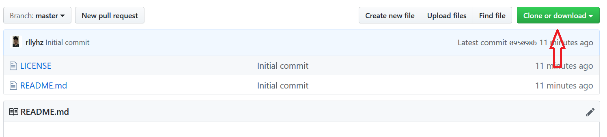

<a id="table-of-content"></a>
## Table of Contents

| No | Content |
| --- | --- |
| 0 | [Introduction](#introduction) |
| 1 | [Environment Setup](#env-setup) |
| 2 | [How To Run this App](#how-to-run) |
| 3 | [Configuration For Yourself](#configuration) |
| 4 | [File Source Code](#file-source-code) |
| 6 | [Follow Me Here](#follow-me) |
| 5 | [References](#references) |


<a id="introduction"></a>
# Hello My Georgeous Friends in The Internet ◕ ‿ ◕

[Today](# "15 December 2019"), I had created something awesome and want to share with yall. That's my second project after **`Text Editor App`**. It is a **`Movie List WebApp`**. This WebApp was built using [`HTML`](https://en.wikipedia.org/wiki/HTML "HyperText Markup Language"), [`CSS`](https://en.wikipedia.org/wiki/Cascading_Style_Sheets "Cascading Style Sheets"), and then [`Javascript`](https://en.wikipedia.org/wiki/JavaScript "Javascript") language for the entire logic of the app. You can run this app in any of the latest Web Browser, such as Chrome (recommended), Firefox, Opera, etc.

**`Movie List WebApp`** use [**`Omdb API`**](http://www.omdbapi.com/) to get all of the data of the movies. So the data will be obtained from the API and be extracted to the website using [AJAX Technology](https://en.wikipedia.org/wiki/Ajax_(programming)). so you no longer need to think about it and just be happy with this simple app :D.

I hope you enjoyed this app and please feel free to download it and to share with your another gorgeous friends around the world! :)

**Love yall** ~emotLove* ❤ 

<br />

[**🡹 Go to the top**](#introduction)

[**🡹 Go to the Table of Contents**](#table-of-content)

<br />

<a id="env-setup"></a>
## Environment Setup

Fortunately, there is no any pre-requirements you have to solve to run it. Just access the `index.html` file on your browser or you can just double click on it to open and there you go 🎉.

<br />

[**🡹 Go to the top**](#env-setup)

[**🡹 Go to the Table of Contents**](#table-of-content)

<br />


<a id="how-to-run"></a>
## Let's play!

**Follow this instruction for the happy fun!**

1. Download the Source Code [here](#file-source-code "Just Click!").
1. Go to the path where the folder of the app is placed ( like `\Path\to\...\MovieListAPI`).
1. Open folder named MovieList.
1. And double click on the `index.html` file to open the root url of the webApp.
1. That's it. You have got all. Have fun!

<br />

[**🡹 Go to the top**](#how-to-run)

[**🡹 Go to the Table of Contents**](#table-of-content)

<br />


<a id="configuration"></a>
## Configuration For Yourself

Now, these are all you can do to this awesome app.

### Set The Name, The Author, and The Version of The App

Open file `PyTextEditor.py` and look at this lines of code:

```python
...
APPNAME = "PyTextEditor"
AUTHOR = "Rully Ihza Mahendra"
APPVERSION = "0.1"
...
```

You can change the value of `APPNAME`, `AUTHOR`, and `APPVERSION` to your own.

```python
...
APPNAME = "My Note"
AUTHOR = "Dzulkifli Ananda"
APPVERSION = "1.0"
...
```

<br />

[**🡹 Go to the top**](#configuration)

[**🡹 Go to the Table of Contents**](#table-of-content)

<br />


<a id="file-source-code"></a>
## Now The Source Code is Yours

### Cloning this repo

On windows, [`Git`](https://git-scm.com/) **must be installed** in your computer before running the command below in Git Bash:
```bash
git clone https://github.com/rllyhz/PyTextEditor.git
```

On MacOs or Linux
```bash
sudo git clone https://github.com/rllyhz/PyTextEditor.git
```
Or you can click the '**Clone or download**' button available in this repo above to download it directly:



<br />

[**🡹 Go to the top**](#file-source-code)

[**🡹 Go to the Table of Contents**](#table-of-content)

<br />


<a id="follow-me"></a>
## Thank You

> _"Thank you for visiting my weekly project. Hope you enjoyed this app!"_

If you love this project, please give me some loves and supports by visiting and following my social media as well to look at some of my next awesome weekly projects, here:
- Instagram -> https://www.instagram.com/rllyhz/
- Twitter -> ...

**_Follow me and stay tuned!!_**

<br />

[**🡹 Go to the top**](#follow-me)

[**🡹 Go to the Table of Contents**](#table-of-content)

<br />


<a id="references"></a>
## References

| Name | Detail |
| --- | --- |
| Python | https://www.python.org/ |
| Python | https://www.python.org/downloads/ |
| Tkinter Module | https://docs.python.org/3.8/library/tkinter.html |
| Creator of Python | https://en.wikipedia.org/wiki/Python_(programming_language) |
| Wikipedia | https://en.wikipedia.org/wiki/Operating_system |

<br />

[**🡹 Go to the top**](#references)

[**🡹 Go to the Table of Contents**](#table-of-content)

<br />

